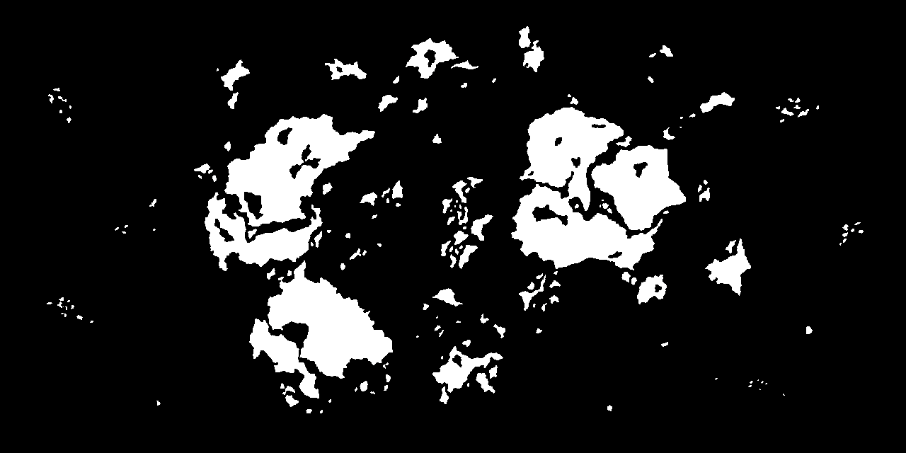
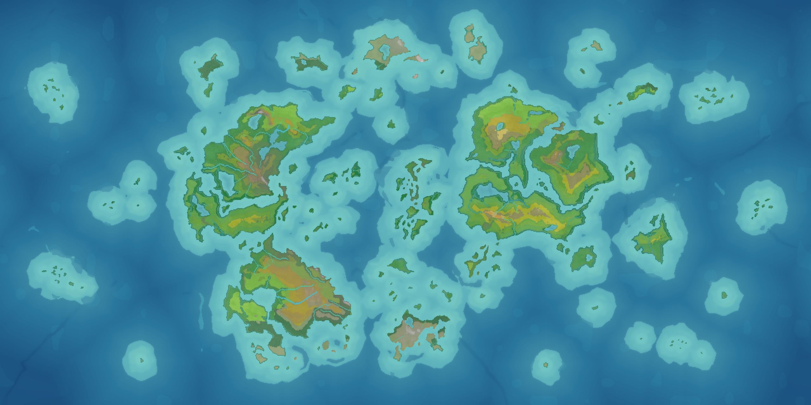
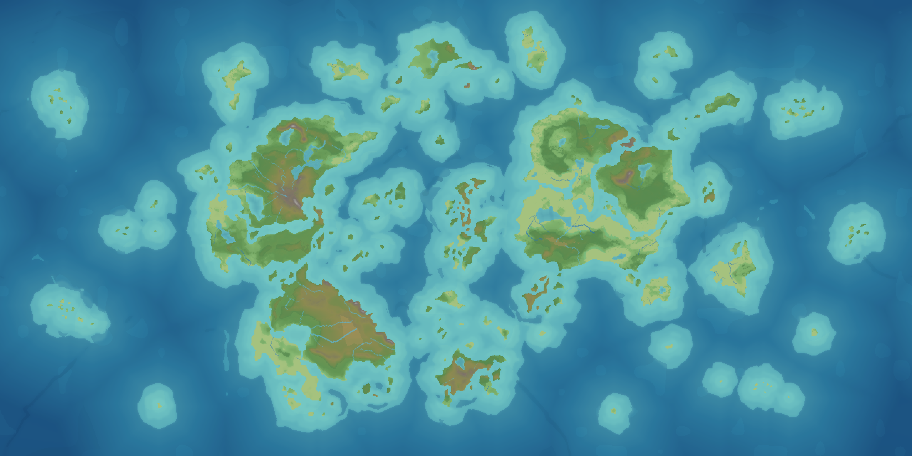

# MapRegionizer

**MapRegionizer** is a tool for generating strategic maps from a simple mask that defines land and water areas.

The project is designed as a step-by-step procedural map generation pipeline: from tectonics and terrain to climate, rivers, and regional subdivision.

> ⚠️ The project is currently in an early stage of development. The API, configuration format, and individual generation stages may change.

## Features

The following generation stages are currently implemented:

* **Planetary tectonics generation**: tectonic plates, crust types, and related base structures.
* **Surface generation**: terrain and river network generation.
* **Climate generation**.
* **Region generation**.

## Usage

MapRegionizer can be used in several ways.

### 1. As a library for .NET applications

This option provides the most flexibility for customizing the generation pipeline. You can disable individual stages, change their order, or add custom stages.

See the documentation: [`docs/generation-pipeline.md`](docs/generation-pipeline.md).

### 2. Through the CLI

The CLI pipeline is intended for using the generator from external applications, scripts, and automated workflows.

[`docs/cli-pipeline.md`](docs/cli-pipeline.md)

### 3. Through the desktop client

A desktop client based on Avalonia is available for manual work with the generator.

The client source code is located in [`src/MapRegionizer.App`](src/MapRegionizer.App).

## Example

An example of practical use of the map generator in a web application:

https://euromeme.ru/map

## Documentation

* [`docs/generation-pipeline.md`](docs/generation-pipeline.md) — generation pipeline overview.
* [`docs/regions.md`](docs/regions.md) — region geometry contract.
* [`docs/tectonics.md`](docs/tectonics.md) — tectonics generation.
* [`docs/elevation.md`](docs/elevation.md) — elevation generation.
* [`docs/hydrology.md`](docs/hydrology.md) — hydrology generation.
* [`docs/climate.md`](docs/climate.md) — climate generation.
* [`docs/agent-pipeline.md`](docs/cli-pipeline.md) — notes on CLI and agent-assisted development.

## Tests

Automated tests are located in `tests/MapRegionizer.Core.Tests`. They cover the
region-generation geometry contract for both `RawRegions` and final `Regions`,
including landmass coverage, water holes, islands, deterministic ids and
geometry for a fixed seed, boundary distortion, and point-only adjacency.

Run the full repository verification with:

```powershell
./scripts/verify.ps1 -Full
```

## Roadmap

* Improve repository structure and documentation for more convenient and efficient agent-assisted development.
* Improve tectonics generation and orogenic province generation to produce more interesting terrain.
* Add mineral deposit generation.
* Add optional terrain-aware region generation.
* Add brushes for manual terrain editing and river creation.
* Add volcano generation and areas of increased seismic activity.
* Add a satellite-like presentational render.
* Add stylized renders.
* Add tile export.
* Add tests for individual generation stages.

## Project Status

The project is under active development and does not yet provide a stable public API. For production-like scenarios, it is recommended to pin a specific version or commit.

## License

This project is licensed under the MIT License. See [`LICENSE.txt`](LICENSE.txt) for details.

## Gallery 
Mask

Climate

Elevation

(seed 42)
___

**MapRegionizer** — программа для генерации стратегических карт на основе простой маски, задающей разделение на сушу и водную поверхность.

Проект предназначен для поэтапной генерации процедурных карт: от тектоники и рельефа до климата, рек и регионального деления.

> ⚠️ Проект находится на ранней стадии разработки. API, формат конфигурации и отдельные стадии генерации могут меняться.

## Возможности

На текущий момент реализованы следующие стадии генерации:

* **Генерация тектоники планеты**: тектонические плиты, типы коры и связанные с ними базовые структуры.
* **Генерация поверхности**: рельеф и речная сеть.
* **Генерация климата**.
* **Генерация регионов**.

## Использование

MapRegionizer можно использовать несколькими способами.

### 1. Как библиотеку для .NET-приложений

Этот вариант предоставляет наибольшие возможности для кастомизации pipeline генерации: можно отключать отдельные стадии, менять их порядок или добавлять собственные этапы.

Подробнее см. в документации: [`docs/generation-pipeline.md`](docs/generation-pipeline.md).

### 2. Через CLI

CLI-пайплайн подходит для использования генератора из сторонних приложений, скриптов и автоматизированных сценариев.

[`docs/cli-pipeline.md`](docs/cli-pipeline.md)

### 3. Через десктопный клиент

Для ручной работы с генератором предусмотрен десктопный клиент на Avalonia.

Исходный код клиента находится в каталоге [`src/MapRegionizer.App`](src/MapRegionizer.App).

## Пример использования

Пример практического использования генератора карт в веб-приложении:

https://euromeme.ru/map

## Документация

* [`docs/generation-pipeline.md`](docs/generation-pipeline.md) — описание pipeline генерации.
* [`docs/regions.md`](docs/regions.md) — геометрический контракт регионов.
* [`docs/tectonics.md`](docs/tectonics.md) — генерация тектоники.
* [`docs/elevation.md`](docs/elevation.md) — генерация рельефа.
* [`docs/hydrology.md`](docs/hydrology.md) — генерация гидрологии.
* [`docs/climate.md`](docs/climate.md) — генерация климата.
* [`docs/cli-pipeline.md`](docs/cli-pipeline.md) — заметки по CLI и агентской разработке.

## Тесты

Авто-тесты расположены в `tests/MapRegionizer.Core.Tests`. Они проверяют
геометрический контракт генерации для `RawRegions` и финальных `Regions`:
покрытие landmass, водные отверстия, острова, детерминированность ID и
геометрии при фиксированном seed, distortion границ и исключение соседства по
одной точке.

Полную проверку репозитория можно запустить так:

```powershell
./scripts/verify.ps1 -Full
```

## Планы развития

* Оформить репозиторий и документацию для более удобной и эффективной агентской разработки.
* Доработать генерацию тектоники и провинций орогенеза для получения более интересного рельефа.
* Добавить генерацию месторождений полезных ископаемых.
* Добавить опциональную адаптацию регионов к рельефу поверхности.
* Добавить кисти для ручного редактирования рельефа и речной сети.
* Добавить генерацию вулканов и зон повышенной сейсмической активности.
* Добавить satellite-like render для презентационного отображения карт.
* Добавить стилизованные рендеры.
* Добавить экспорт тайлов.
* Добавить тесты для отдельных стадий генерации.

## Статус проекта

Проект активно развивается и пока не претендует на стабильность публичного API. Перед использованием рекомендуется фиксировать конкретную версию или commit.

## Лицензия

Проект распространяется под лицензией MIT. Подробнее см. [`LICENSE.txt`](LICENSE.txt).
